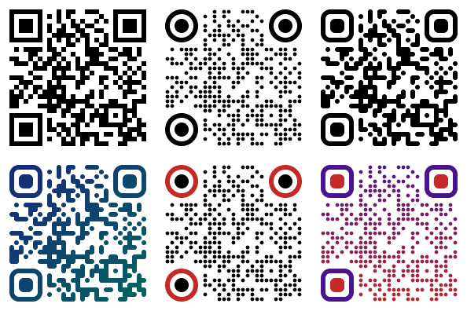

<h1 align="center">go-qr</h1>

<p align="center">
  Zero-dependency QR Code encoding, styling and decoding for Go.
</p>

<p align="center">
  <a href="https://pkg.go.dev/github.com/piglig/go-qr/v2"></a>
  <a href="https://github.com/piglig/go-qr/actions/workflows/go.yml?query=branch%3Amain"></a>
  <a href="https://app.codecov.io/github/piglig/go-qr"></a>
  <a href="https://goreportcard.com/report/github.com/piglig/go-qr/v2"></a>
  <a href="https://github.com/avelino/awesome-go#utilities"></a>
  <a href="LICENSE"></a>
</p>

<p align="center">
  <a href="https://piglig.github.io/go-qr/"><b>Playground</b></a> ·
  <a href="docs/getting-started.md"><b>Getting started</b></a> ·
  <a href="docs/README.md"><b>Documentation</b></a> ·
  <a href="https://pkg.go.dev/github.com/piglig/go-qr/v2"><b>API reference</b></a>
</p>

<p align="center">
  
</p>

## Why go-qr

- **Complete.** QR Code Model 2 as specified by ISO/IEC 18004: all 40
  versions, all four error correction levels, numeric, alphanumeric, byte
  and Kanji modes, ECI, structured append and GS1.
- **Compact codes by default.** `Encode` switches modes within the text, picks
  the smallest version and raises error correction into spare capacity.
- **Styled, and still readable.** Dot and rounded modules, round finders,
  colors, gradients and logos. `Verify` renders the result, decodes it and
  checks the contrast, so you know a design scans before you publish it.
- **A decoder that reads photos.** Perspective, lens distortion, glare,
  photos of screens and codes with a damaged finder pattern. It reads about
  as many real photos as zxing-cpp and more than WeChat, ZBar and gozxing
  ([comparison](docs/explanation/performance.md#reading-photos)).
- **Fast and dependency-free.** Only the standard library. Encoding is about
  3× faster than [skip2/go-qrcode] and decoding about 7× faster than
  [gozxing], with orders of magnitude fewer allocations
  ([benchmarks](docs/explanation/performance.md)).

## Install

```shell
go get github.com/piglig/go-qr/v2
```

Requires Go 1.23 or later. Upgrading from v1? See [Upgrading to v2](docs/guides/upgrading-to-v2.md).

## Quick start

```go
package main

import (
	"log"
	"os"

	"github.com/piglig/go-qr/v2"
)

func main() {
	code, err := qr.Encode("https://github.com/piglig/go-qr")
	if err != nil {
		log.Fatal(err)
	}
	png, err := code.PNG(qr.WithModuleShape(qr.ModuleRounded))
	if err != nil {
		log.Fatal(err)
	}
	if err := os.WriteFile("qr.png", png, 0o644); err != nil {
		log.Fatal(err)
	}
}
```

Decode an image:

```go
res, err := qr.Decode(img) // any image.Image
fmt.Println(res.Text)
```

The [getting started tutorial](docs/getting-started.md) goes from here to a
styled, verified code in a few minutes.

## Documentation

| | |
| --- | --- |
| **Tutorial** | [Getting started](docs/getting-started.md) |
| **Guides** | [Encoding](docs/guides/encoding.md) · [Rendering](docs/guides/rendering.md) · [Styling](docs/guides/styling.md) · [Decoding](docs/guides/decoding.md) · [Payloads](docs/guides/payloads.md) · [Batch processing](docs/guides/batch.md) · [Troubleshooting](docs/guides/troubleshooting.md) · [Command-line tool](docs/guides/cli.md) · [AI assistants (MCP)](docs/guides/mcp.md) |
| **Reference** | [API on pkg.go.dev](https://pkg.go.dev/github.com/piglig/go-qr/v2) · [Errors](docs/reference/errors.md) · [Standards support](docs/reference/standards.md) · [Changelog](CHANGELOG.md) |
| **Background** | [How it works](docs/explanation/how-it-works.md) · [Performance](docs/explanation/performance.md) |

## Command-line tool

```shell
go install github.com/piglig/go-qr/tools/generator@latest
generator encode -png hello.png "Hello, world!"
generator decode hello.png
```

See the [CLI guide](docs/guides/cli.md) for every flag.

## AI assistants

`go-qr-mcp` is an [MCP](https://modelcontextprotocol.io) server that lets
Claude, Cursor and other assistants decode, generate and inspect QR Codes
exactly, instead of guessing from pixels, and flags risky content such as
lookalike URLs or embedded 2FA secrets:

```shell
go install github.com/piglig/go-qr/mcp/cmd/go-qr-mcp@latest
claude mcp add go-qr -- go-qr-mcp
```

See the [MCP guide](docs/guides/mcp.md) for other clients and the tools.

## Contributing

Bug reports, ideas and pull requests are welcome. Read
[CONTRIBUTING.md](CONTRIBUTING.md) for how to set up the repository, run the
tests and fuzzers, and send a change. Report security issues privately as
described in [SECURITY.md](SECURITY.md).

## License

[MIT](LICENSE)

[skip2/go-qrcode]: https://github.com/skip2/go-qrcode
[gozxing]: https://github.com/makiuchi-d/gozxing
