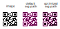

# go-qr
[](https://github.com/avelino/awesome-go#utilities)
[](https://goreportcard.com/report/github.com/piglig/go-qr)
[](https://github.com/piglig/go-qr/actions/workflows/go.yml?query=branch%3Amain)
[](https://app.codecov.io/github/piglig/go-qr)
[](https://pkg.go.dev/github.com/piglig/go-qr)
[](https://github.com/piglig/go-qr/blob/main/LICENSE)

> 🎶 Go Community Minimalist QR Code Generator Library.

## Overview
This library is native, high quality and minimalistic. Generate QR code from string text
 
It is mostly a translation of [project Nayuki's Java version of the QR code generator](https://www.nayuki.io/page/qr-code-generator-library).

## Features
* Minimalist native code implementation
* Based on QR Code Model 2 standard, supports all 40 versions and all 4 error correction levels
* Output format: Raw modules/pixels of the QR symbol
* Detects finder-like penalty patterns more accurately than other implementations
* Encoding space optimisation for numeric and special alphanumeric texts
* Japanese Unicode Text Encoding Optimisation
* For mixed numeric/alphanumeric/general/kanji text, computes optimal segment mode switching
* Good test coverage
* MIT's Open Source License

## Installation
```go
go get github.com/piglig/go-qr
```

## [Examples](https://github.com/piglig/go-qr/tree/master/example/main.go)
```go
package main

import (
	go_qr "github.com/piglig/go-qr"
	"image/color"
)

func main() {
	doBasicDemo()
}

func doBasicDemo() {
	text := "Hello, world!"
	errCorLvl := go_qr.Low
	qr, err := go_qr.EncodeText(text, errCorLvl)
	if err != nil {
		return
	}
	config := go_qr.NewQrCodeImgConfig(10, 4)
	err = qr.PNG(config, "hello-world-QR.png")
	if err != nil {
		return
	}

	err = qr.SVG(config, "hello-world-QR.svg", "#FFFFFF", "#000000")
	if err != nil {
		return
	}
}
```

## Command Line Tool
**generator** command line tool to generate the QR Code.
### Installation
In order to use the tool, compile it using the following command
```shell
go install github.com/piglig/go-qr/tools/generator@latest
```

### Usage
```shell
generator [options] [arguments]
  -content string
        Content to encode in the QR code
  -png string
        Output PNG file name
  -svg string
        Output SVG file name
  -svg-optimized
        Output optimized SVG file name - regions with connected black pixels are merged into a single path
```

### Example
* **Text Art**
```shell
generator -content hello
```


* **Image Type**
```shell
generator -content hello -png hello.png -svg hello.svg
```


* **Optimized SVG Type**
```shell
generator -content hello -svg hello.svg -svg-optimized hello-optimized.svg 
```
The optimized svg output create paths around connected black regions. This reduces the file size and rendering artifacts.


## License
See the [LICENSE](LICENSE) file for license rights and limitations (MIT).